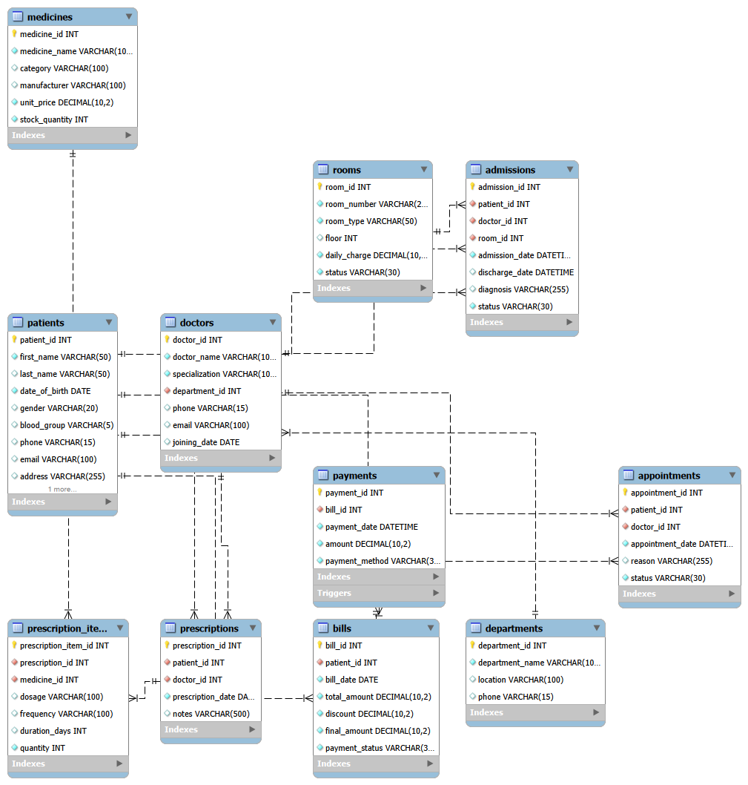
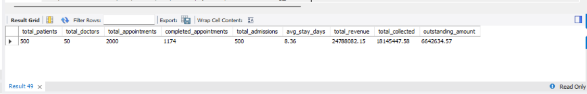
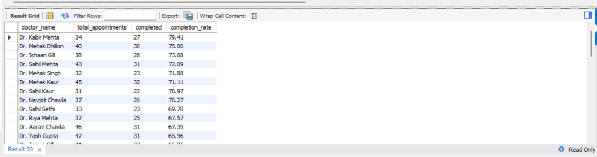
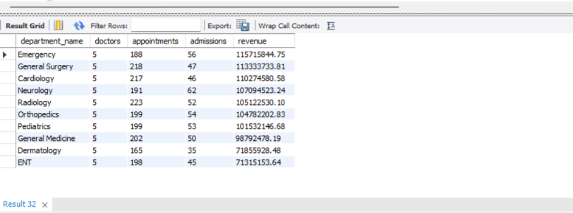
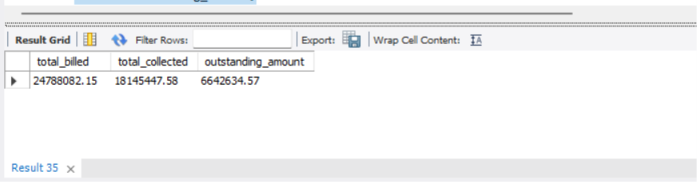

# 🏥 Hospital Management System — SQL & DBMS Project

A relational Hospital Management System built using **MySQL** to manage patients, doctors, departments, appointments, admissions, prescriptions, medicines, billing, and payments.

The project focuses on database design, relational data modeling, SQL querying, data analysis, and advanced MySQL features.

---

## 📌 Project Overview

This project simulates the backend database of a hospital management system.

The database stores and connects information about:

- Patients
- Doctors
- Hospital departments
- Appointments
- Patient admissions
- Rooms
- Prescriptions
- Medicines
- Bills
- Payments

The system was designed using a relational database model with **Primary Keys, Foreign Keys, Constraints, Views, Indexes, Stored Procedures, Functions, and Triggers**.

The project also includes analytical SQL queries to generate insights about hospital operations, doctor performance, department performance, patient activity, inventory, and financial performance.

---

## 🎯 Objectives

- Design a normalized relational database for a hospital
- Establish relationships between multiple entities
- Practice SQL from basic to advanced level
- Perform operational and analytical queries
- Analyze hospital performance using SQL
- Implement reusable database objects
- Demonstrate real-world DBMS concepts

---

## 🗄️ Database Structure

The database contains **11 relational tables**:

| Table | Purpose |
|---|---|
| `departments` | Stores hospital department information |
| `doctors` | Stores doctor details and department assignments |
| `patients` | Stores patient information |
| `appointments` | Stores patient-doctor appointments |
| `admissions` | Tracks hospital admissions and room allocation |
| `rooms` | Stores room information and availability |
| `prescriptions` | Stores prescriptions issued to patients |
| `prescription_items` | Stores medicines included in prescriptions |
| `medicines` | Manages medicine inventory |
| `bills` | Stores patient billing information |
| `payments` | Tracks payments made against bills |

---

## 🔗 Entity Relationship Diagram

The database relationships are represented in the following EER diagram:



### Main Relationships

- A department can have multiple doctors
- A doctor can have multiple appointments
- A patient can have multiple appointments
- A patient can have multiple admissions
- A doctor can manage multiple admissions
- An admission is associated with a room
- A patient can have multiple prescriptions
- A prescription can contain multiple medicines
- A bill can be associated with an admission
- A bill can have multiple payments

---

## 📊 Dataset

The database is populated with sample hospital data containing:

- **500 patients**
- **50 doctors**
- **2,000 appointments**
- **500 admissions**

The dataset is used to demonstrate realistic SQL querying and analytical operations.

---

## 🧠 SQL Concepts Demonstrated

### Basic SQL

- `SELECT`
- `WHERE`
- `ORDER BY`
- `LIMIT`
- `DISTINCT`
- `IN`
- `BETWEEN`
- `LIKE`
- `AND / OR / NOT`

### Aggregate Functions

- `COUNT()`
- `SUM()`
- `AVG()`
- `MIN()`
- `MAX()`

### Data Grouping

- `GROUP BY`
- `HAVING`

### Joins

- `INNER JOIN`
- `LEFT JOIN`
- Multiple-table joins

### Conditional Logic

- `CASE`

### Subqueries

- Scalar subqueries
- Nested queries
- Subqueries with aggregates

### Date & Time Analysis

- `YEAR()`
- `MONTH()`
- `DATE_FORMAT()`
- `DATEDIFF()`

### Advanced SQL

- Common Table Expressions (`CTE`)
- Window Functions
- `RANK()`
- `ROW_NUMBER()`
- `LAG()`
- `LEAD()`
- `PARTITION BY`
- Running totals

---

## ⚙️ MySQL Database Features

The project also demonstrates several database-level features.

### Views

Created reusable views for:

- Patient appointments
- Patient admissions
- Patient billing

### Indexes

Indexes were created on frequently queried columns such as:

- Patient IDs
- Doctor IDs
- Appointment dates
- Bill dates
- Admission-related fields

### Stored Procedures

Examples include:

- Retrieving patient appointments
- Analyzing doctor workload
- Retrieving patient billing information

### Stored Function

A custom function is used to calculate patient age from the date of birth.

### Trigger

A payment trigger automatically updates the billing payment status based on the total amount paid.

---

## 📈 Hospital Analytics

The project contains SQL-based analysis for:

### 👨‍⚕️ Doctor Performance

- Total appointments
- Completed appointments
- Appointment completion rate
- Doctor workload
- Top-performing doctors

### 🏥 Department Analysis

- Number of doctors
- Appointment volume
- Admission volume
- Department revenue
- Appointment share

### 👤 Patient Analysis

- Patient demographics
- Most frequent visitors
- Highest-spending patients
- Patients without appointments
- Patients with multiple admissions

### 💊 Medicine & Inventory Analysis

- Most prescribed medicines
- Low-stock medicines
- Inventory value
- Inventory value by category

### 💰 Financial Analysis

- Total billed amount
- Total collected amount
- Outstanding amount
- Payment status
- Outstanding bills
- Monthly revenue

### 🛏️ Admission Analysis

- Average hospital stay
- Longest hospital stays
- Most common diagnoses
- Monthly admissions

---

## 📊 Key Hospital KPIs

Based on the sample dataset:

| KPI | Value |
|---|---:|
| Total Patients | 500 |
| Total Doctors | 50 |
| Total Appointments | 2,000 |
| Completed Appointments | 1,174 |
| Total Admissions | 500 |
| Average Stay | 8.36 days |
| Total Revenue | 24,788,082.15 |
| Amount Collected | 18,145,447.58 |
| Outstanding Amount | 6,642,634.57 |

---

## 📸 Project Screenshots

### Hospital KPI Overview



### Doctor Performance



### Department Performance



### Financial Analysis



---

## 📁 Project Structure

```text
hospital-management-sql/
│
├── README.md
│
├── database/
│   ├── 01_create_database.sql
│   ├── 02_create_tables.sql
│   └── 03_import_data.sql
│
├── queries/
│   ├── 04_basic_queries.sql
│   ├── 05_advanced_queries.sql
│   ├── 06_database_features.sql
│   └── 07_hospital_analytics.sql
│
├── diagrams/
│   └── hospital_er_diagram.png
│
└── screenshots/
    ├── hospital_kpi.png
    ├── financial_analysis.png
    ├── department_performance.png
    └── doctor_performance.png

    🚀 How to Run the Project
1. Install MySQL

Use MySQL 8.0+ with MySQL Workbench.

2. Create the database

Run:

database/01_create_database.sql
3. Create the tables

Run:

database/02_create_tables.sql
4. Import the dataset

Run:

database/03_import_data.sql

Update the CSV file paths in 03_import_data.sql according to the location of the dataset on your computer.

5. Run the SQL queries

The queries are organized into:

queries/04_basic_queries.sql
queries/05_advanced_queries.sql
queries/06_database_features.sql
queries/07_hospital_analytics.sql
🛠️ Technologies Used
MySQL 8.0
MySQL Workbench
SQL
Relational Database Management System (RDBMS)
💡 Key Learning Outcomes

Through this project, I practiced:

Relational database design
Entity Relationship modeling
Primary and Foreign Keys
Constraints
Multi-table joins
Aggregation and grouping
Subqueries
Common Table Expressions
Window functions
Database views
Indexing
Stored procedures
Stored functions
Triggers
SQL-based business analytics
🔍 Example Business Questions Answered

The project uses SQL to answer questions such as:

Which doctors handle the highest number of appointments?
Which doctors have the highest completion rates?
Which departments receive the most appointments?
Which departments generate the most revenue?
Which patients spend the most?
Which medicines are prescribed most frequently?
Which medicines have low stock?
What is the average hospital stay?
Which patients have outstanding bills?
How much revenue has been collected?
How much revenue remains outstanding?
How does hospital activity vary over time?
📌 Project Highlights
11-table relational database
500 patients
50 doctors
2,000 appointments
500 admissions
Multiple interconnected hospital workflows
Advanced SQL using CTEs and window functions
Views, indexes, stored procedures, functions, and triggers
EER database design
Hospital KPI and financial analysis
👨‍💻 Author

Amritpal Singh

A DBMS and SQL project focused on applying relational database concepts and analytical SQL to a realistic hospital management use case.